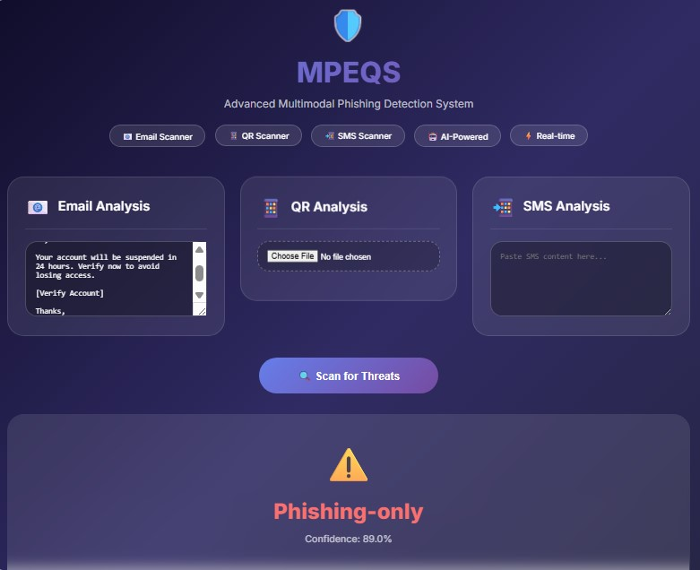

# MPEQS: A Multimodal Framework for Detecting Phishing Emails, Quishing, and Smishing Attacks


*Example: Email phishing detection with 89% confidence*


*Example: Benign content detection with 88.8% confidence*

---

## Introduction

MPEQS is a novel multimodal framework that simultaneously detects **Phishing Emails**, **Quishing (QR code phishing)**, and **Smishing (SMS phishing)** attacks. Unlike traditional systems that analyze each threat vector in isolation, MPEQS uses three specialized encoders (ELECTRA for emails, MobileNetV2 for QR codes, DistilBERT for SMS) with a cross-attention fusion mechanism to learn relationships between modalities. The framework outputs five fine-grained attack classifications: Benign, Phishing-only, Quishing-only, Smishing-only, or Mixed Attack, enabling targeted incident response.

---
## 📸 Project Preview

*Example: Email phishing detection with 89% confidence*


*Example: Benign content detection with 88.8% confidence*

---


## Libraries Used

```python
# Core Libraries
import torch                          # Deep learning framework
import torch.nn as nn                 # Neural network layers
import numpy as np                    # Numerical operations
import pandas as pd                   # Data loading and manipulation

# Transformers & NLP
from transformers import ElectraModel, ElectraTokenizer      # Email encoder
from transformers import DistilBertModel, DistilBertTokenizer # SMS encoder

# Computer Vision
import torchvision.models as tv_models  # MobileNetV2 for QR codes
import cv2                              # Image processing

# Machine Learning
from sklearn.ensemble import RandomForestClassifier  # Correction judges
from sklearn.metrics import accuracy_score, precision_score, recall_score, f1_score

# Web Framework
from flask import Flask, request, jsonify, render_template_string  # Web interface
from flask_cors import CORS

# Visualization
import matplotlib.pyplot as plt
import seaborn as sns

# Utilities
import pickle                           # Model saving/loading
from concurrent.futures import ThreadPoolExecutor  # Parallel QR loading
import warnings
warnings.filterwarnings('ignore')
## Features

| # | Feature | Description |
|---|---------|-------------|
| 1 | Multimodal Detection | Simultaneously analyzes emails, QR codes, and SMS messages in a single unified pipeline. |
| 2 | Cross-Attention Fusion | Uses an attention mechanism to dynamically learn relationships between email, QR, and SMS modalities instead of relying on static feature weights. |
| 3 | Five-Class Classification | Predicts one of five attack categories: Benign, Phishing-only, Quishing-only, Smishing-only, or Mixed Attack. |
| 4 | Real-Time Web Interface | Provides a Flask-based web application with live predictions, confidence scores, and visual outputs. |

---

## Future Contributions

| # | Future Enhancement | Description |
|---|-------------------|-------------|
| 1 | Multilingual Support | Extend ELECTRA and DistilBERT to support non-English phishing emails and SMS using XLM-RoBERTa or Multilingual BERT. |
| 2 | Adversarial Robustness | Evaluate and strengthen model resilience against adversarial QR codes and intentionally manipulated text inputs. |
| 3 | Mobile App Deployment | Convert the model to TensorFlow Lite or ONNX for efficient on-device scanning without cloud dependency. |

